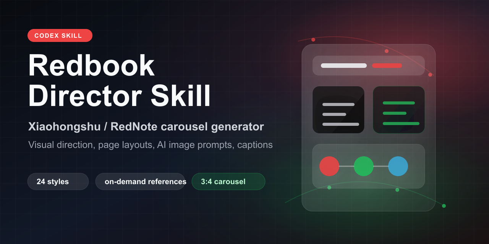
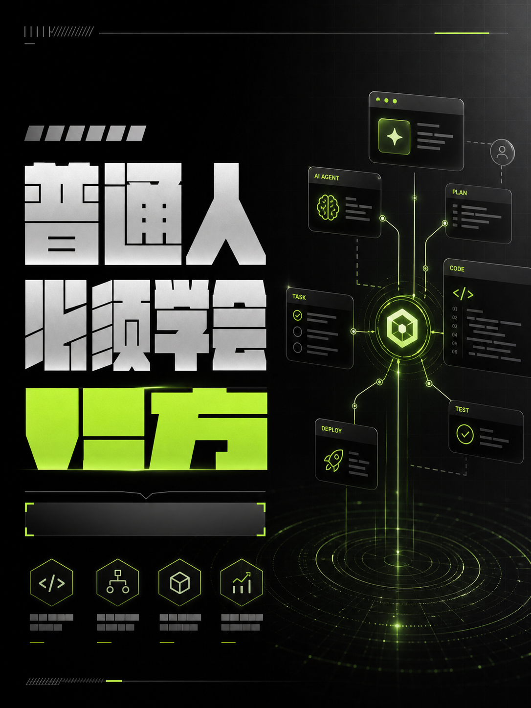
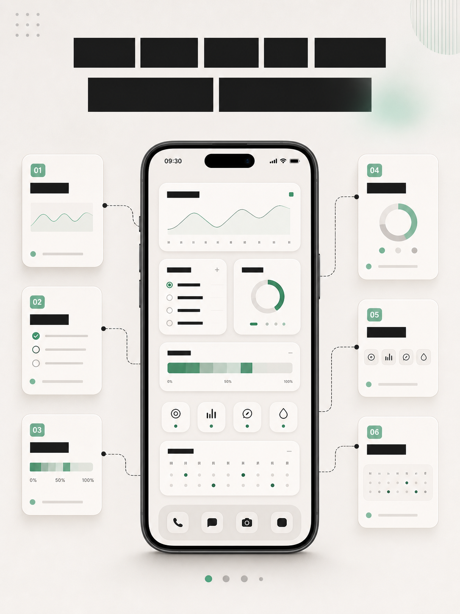

# RedNote Director Skill｜Xiaohongshu / RedNote Carousel Generator

[](#)
[](README.en.md)
[](README.md)
[](#)
[](#)
[](#)
[](#)

[中文 README](README.md) · **English**

<p align="center">
  
</p>

RedNote Director Skill is a platform-agnostic Agent Skill for **Xiaohongshu / RedNote creators** (primarily Chinese-speaking audiences). It turns topics, drafts, screenshots, or reference images into publish-ready premium carousel posts—not generic copy, but full visual direction: content judgment, style selection, page structure, per-page layout, AI image prompts, captions, hashtags, and a self-review checklist. Works with Cursor, Claude, Codex, and other compatible agent clients.

**Keywords**: Xiaohongshu carousel generator, RedNote carousel generator, Xiaohongshu content generator, Xiaohongshu post template, Xiaohongshu cover design, AI image prompts, 小红书图文, 小红书封面, 小红书运营, Agent Skill, Cursor skill, Claude skill, 3:4 carousel, visual director workflow.

## Quick Install

```bash
git clone https://github.com/mythkiven/rednote-director-skill.git ~/.agents/skills/rednote-director-skill
```

Example prompt:

```text
Use $rednote-director-skill. Turn this topic into a 6-page Xiaohongshu / RedNote carousel. Include the visual style rationale, page-by-page layout, AI image prompts, caption, hashtags, and review checklist.
```

Typical outputs:

- Xiaohongshu / RedNote carousel strategy
- Cover hook and page-by-page visual direction
- 3:4 image prompt templates for each page
- Caption, hashtags, and comment prompt
- Visual quality checklist for readability and premium design

## Cover Examples

These samples show the default 3:4 cover direction: premium, clear, mobile-readable, and free of cheap AI-template vibes.

<p align="center">
  
  
  
</p>
<p align="center">
  
  
</p>
<p align="center">
  
  
</p>

## Sample Cases


| Example | Best for | Recommended styles |
| --- | --- | --- |
| Vibe Coding | AI, Agents, tech opinions, methodology | Dark tech magazine + B&W gray neon green impact |
| AI for merchants | Business trends, industry solutions, foreign trade, cross-border e-commerce | Premium business proposal + global trade network |
| Phone dashboard | Real cases, tool tutorials, workflow makeovers | Phone screenshot makeover + Notion premium cards |

## Who It's For

- Xiaohongshu / RedNote carousel creators
- AI / Vibe Coding / Agent content creators
- Personal brand builders
- Product managers, designers, founders
- Anyone turning drafts, screenshots, product shots, or slides into premium carousels

## What It Solves

- Unsure which visual style fits your topic.
- Carousels that feel like slides, with weak click appeal.
- AI images that look cheap—blue-purple gradients, unreadable text.
- Flat pacing with no rhythm across pages.
- Weak covers and inner pages with little save value.
- Need to turn personal taste into a reusable visual workflow.

## How to Use

Install or reference this directory as an Agent Skill, then give the agent a topic, draft, screenshot description, product image need, reference style, or layout optimization request. Default output includes:

1. Topic assessment
2. Core thesis
3. Style rationale report
4. Three style directions
5. Recommended direction
6. 6–8 page carousel structure
7. Per-page visual plan
8. Image generation prompts for each page
9. Unified visual spec
10. Title, body copy, hashtags, and comment hook
11. Self-review checklist

## Installation

This repo follows the standard Skill layout: the repo root is the installable Skill directory and includes `SKILL.md` at the top level.

```text
rednote-director-skill/
├── SKILL.md
├── agents/openai.yaml
├── references/
├── examples/
└── assets/
    ├── *.md
    └── covers/
```

Copy or symlink the entire `rednote-director-skill/` directory—not just `SKILL.md`. `references/`, `assets/`, and `examples/` are loaded on demand at runtime.

## Input Example

```text
Topic: Why ordinary people must learn Vibe Coding now?
Goal: An 8-page Xiaohongshu carousel—premium and tech-forward, but not a cheap AI template.
```

## Output Example

```text
# Style Rationale Report
Primary style: Dark tech magazine
Supporting styles: Architecture / system breakdown + B&W gray neon green impact
Avoid: Liquid glass aurora diffusion
Reason: This topic needs cognitive impact and credibility; overly dreamy visuals weaken the methodology.
```

Full example: `examples/example_output_plan.md`.

Industry / business example: `examples/example_output_yiwu_plan.md`.

## Recommended Workflow

1. Submit a topic or draft.
2. Ask for the style rationale report first—don't rush page generation.
3. Pick one of the three style directions.
4. Generate the 8-page structure and per-page prompts.
5. Generate images from the prompts.
6. Review readability and premium feel with `assets/visual_review_checklist.md`.
7. Generate title, body, hashtags, and pinned comment.

## Adding Reference Images

When you share reference images, say what to borrow:

- Color palette
- Composition
- Typography hierarchy
- Materials / textures
- Cover impact
- What **not** to copy

Don't say "match this style" alone—name the reusable visual traits.

## Extending Styles

When adding a style, include at least:

- Style name
- Suitable content types
- Unsuitable content types
- Visual temperament
- Colors
- Typography
- Layout
- Common elements
- Image prompt template
- Negative prompts
- Example title patterns

Also update:

- A new `references/style-XX-*.md` file
- `references/style_system.md` style index
- `assets/style_extension_template.md` as the fill-in template
- `examples/style_reference_notes.md` when needed

## Maintaining Examples

Examples show reusable decisions, not literary flair. Each should include:

- Input topic
- Content type judgment
- Recommended style combination
- Page structure
- At least 5 copy-ready image prompts
- Publishing copy
- Self-review results

## Quality Checklist

A solid output should:

- Judge content before picking style.
- Explain why a style fits and why others don't.
- Give the cover a click hook.
- Build inner pages with progression and save value.
- Assign one main communication task per page.
- Include aspect ratio, layout, text zones, fonts, colors, hero visual, whitespace, and bans in prompts.
- Avoid cheap AI tech look, slide-deck feel, overload, and unreadable text.

---

Forked and rebuilt from [ziguishian/xhs-visual-director-skill](https://github.com/ziguishian/xhs-visual-director-skill).
